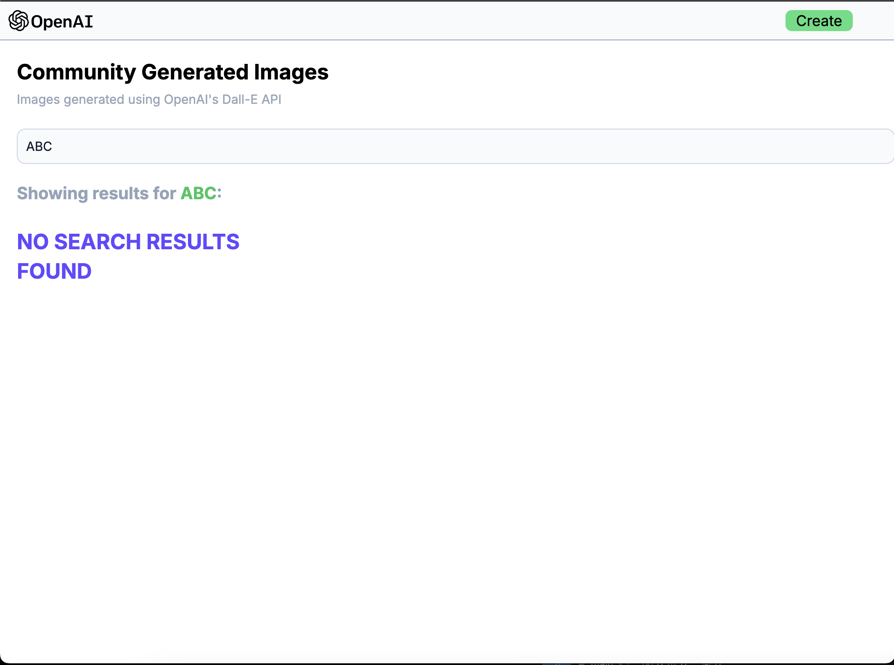
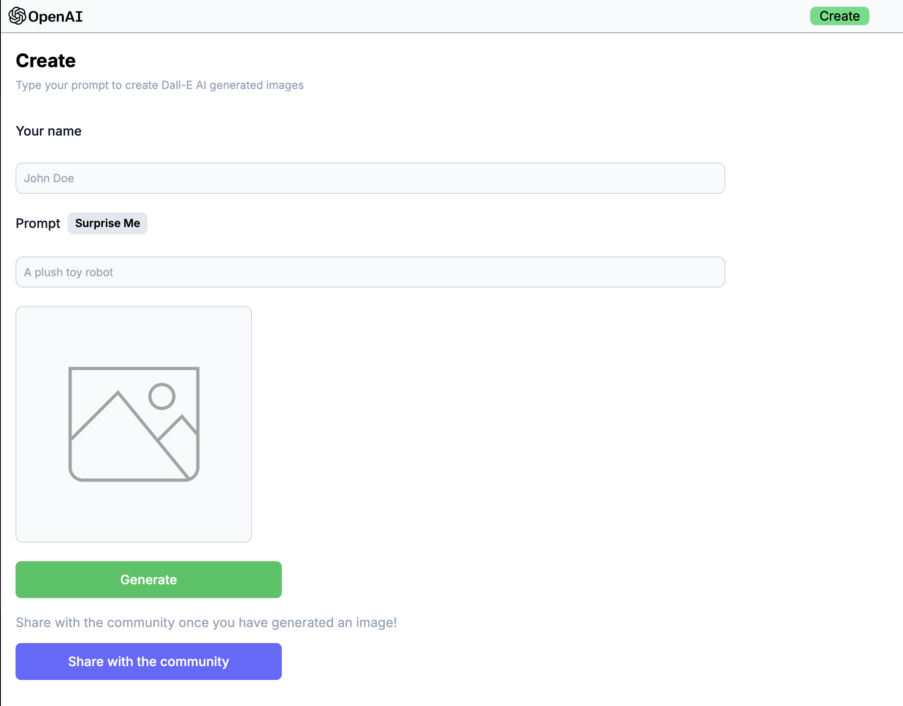

# AI Image Generator (DALL-E Clone)

Full stack DALL-E clone developed using MERN stack (MongoDB, Express.js, React.js, Node.js). Used OpenAI's image generation api (using DALL-E). Also used Cloudinary to generate photo Urls to optimize image storage in the backend.

